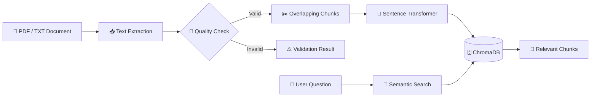
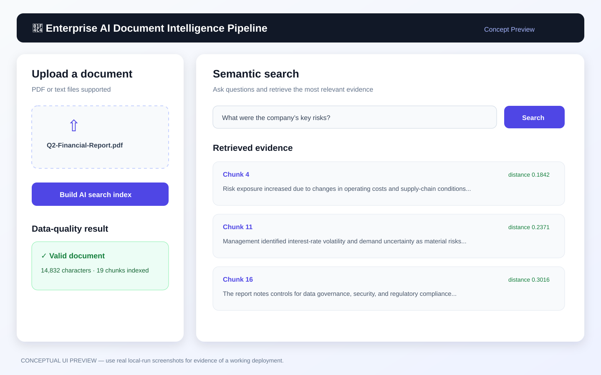

<div align="center">

# 📄 Enterprise AI Document Intelligence Pipeline

### Turn PDFs and text documents into a searchable AI knowledge base

[](https://www.python.org/)
[](https://streamlit.io/)
[](https://www.trychroma.com/)
[](https://github.com/archana24v-web/enterprise-ai-document-intelligence-pipeline/actions/workflows/ci.yml)
[](LICENSE)

**An AI data-engineering portfolio project for document ingestion, data-quality validation, embeddings, and semantic retrieval.**

[✨ Features](#-features) · [🏗️ Architecture](#️-architecture) · [🎨 Concept preview](#-concept-preview) · [🚀 Quick start](#-quick-start) · [🧪 Testing](#-testing) · [🗺️ Roadmap](#️-roadmap)

</div>

---

## 🎯 The problem

Teams store valuable information in PDFs, reports, policies, and other unstructured documents. Finding the correct answer is slow because normal keyword search cannot understand meaning.

This project creates a local **AI document-intelligence pipeline** that converts documents into searchable vector data. A user uploads a PDF or text file, the pipeline validates and chunks the content, creates embeddings, stores them in ChromaDB, and returns the most relevant passages for a question.

> **Example:** Upload a financial report and ask: *“What were the company’s key risks?”* The application retrieves the most relevant report sections instead of requiring you to read the entire document.

## ✨ Features

| Capability | What it demonstrates |
|---|---|
| 📤 Document ingestion | Upload `.pdf` and `.txt` documents through Streamlit |
| 🧹 Data quality | Detects documents with insufficient extracted text |
| ✂️ Chunking | Creates overlapping text chunks for retrieval |
| 🧠 AI embeddings | Uses Sentence Transformers (`all-MiniLM-L6-v2`) |
| 🗄️ Vector database | Stores searchable embeddings in ChromaDB |
| 🔎 Semantic retrieval | Finds passages related by meaning, not only keywords |
| ✅ Automated tests | Validates chunking and data-quality logic with Pytest |
| 🔁 CI pipeline | Runs tests automatically on pushes and pull requests |
| 🐳 Container-ready | Includes a Dockerfile for consistent local execution |

## 🏗️ Architecture



## 🎨 Concept preview

> This is a visual concept for the planned Streamlit interface. It is not presented as a live-run screenshot. Replace it with real screenshots after running the app locally.



## 🧰 Tech stack

| Layer | Technologies |
|---|---|
| Application | Python, Streamlit |
| Document processing | PyPDF |
| AI / embeddings | Sentence Transformers |
| Vector storage | ChromaDB |
| Testing | Pytest |
| Delivery | Docker, GitHub Actions |

## 📁 Repository map

```text
├── app/                    # Streamlit user interface
│   └── streamlit_app.py
├── docs/                   # Architecture and project documentation
│   ├── architecture.md
│   └── images/
├── src/                    # Reusable pipeline components
│   ├── ingest.py           # PDF extraction helpers
│   ├── quality_checks.py   # Data validation rules
│   ├── chunking.py         # Overlapping chunk logic
│   └── vector_store.py     # Embeddings and ChromaDB search
├── tests/                  # Automated unit tests
├── .github/workflows/      # GitHub Actions CI
├── Dockerfile
└── requirements.txt
```

## 🚀 Quick start

### 1. Clone the project

```bash
git clone https://github.com/archana24v-web/enterprise-ai-document-intelligence-pipeline.git
cd enterprise-ai-document-intelligence-pipeline
```

### 2. Create and activate a virtual environment

```bash
python -m venv .venv
```

**Windows PowerShell**

```powershell
.venv\Scripts\Activate.ps1
```

**macOS / Linux**

```bash
source .venv/bin/activate
```

### 3. Install packages and start the app

```bash
pip install -r requirements.txt
streamlit run app/streamlit_app.py
```

Open **http://localhost:8501** in your browser. The first embedding run downloads the open-source model locally.

## 🧪 Testing

Run the unit-test suite locally:

```bash
pytest -q
```

Every push and pull request triggers the GitHub Actions workflow. This protects core data-pipeline logic from regressions.

## 🐳 Docker

```bash
docker build -t ai-document-intelligence .
docker run -p 8501:8501 ai-document-intelligence
```

Then visit **http://localhost:8501**.

## 📊 Data-engineering highlights

- Separates ingestion, validation, transformation, and storage into modular components.
- Adds a validation gate before costly embedding operations.
- Uses deterministic chunk IDs and metadata to support future lineage and observability.
- Treats CI and automated testing as first-class pipeline requirements.
- Runs locally without requiring a paid AI API key.

## 🗺️ Roadmap

- [x] PDF and text ingestion
- [x] Data-quality checks and text chunking
- [x] Embeddings and ChromaDB vector search
- [x] Streamlit interface
- [x] Pytest and GitHub Actions CI
- [ ] Add cited LLM answers over retrieved chunks
- [ ] Add metadata filters and document lineage
- [ ] Add Docker Compose and cloud object storage
- [ ] Deploy the application and add demo screenshots

## 👤 Author

Built as a hands-on AI Data Engineering portfolio project by [Archana](https://github.com/archana24v-web).

If this project helps you, consider giving it a ⭐.
