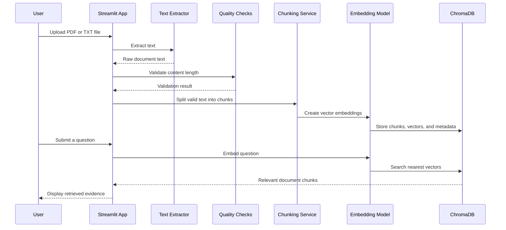

# System Architecture

## Purpose

This document explains how the Enterprise AI Document Intelligence Pipeline turns unstructured documents into a local semantic-search experience. The design intentionally separates ingestion, validation, transformation, vector storage, and retrieval so that each component can be tested and replaced independently.

## Data flow



## Components

| Component | Responsibility | Current implementation |
|---|---|---|
| User interface | Accepts files and questions, displays results | Streamlit |
| Extraction | Reads text from supported document formats | PyPDF / UTF-8 decoding |
| Quality gate | Stops empty or very short documents from entering the pipeline | `validate_document()` |
| Transformation | Normalizes and splits text with overlap | `chunk_text()` |
| Embedding service | Converts document chunks and questions to vectors | Sentence Transformers `all-MiniLM-L6-v2` |
| Vector store | Persists vectors and retrieves similar passages | ChromaDB |
| Automated delivery | Runs test suite after repository changes | GitHub Actions |

## Data contracts

### Document chunk

```json
{
  "id": "chunk-0",
  "text": "Extracted content from the source document...",
  "metadata": {
    "chunk_number": 1
  }
}
```

### Search result

```json
{
  "chunk_number": 1,
  "text": "Most relevant retrieved passage...",
  "distance": 0.1842
}
```

## Reliability considerations

- **Validation before embeddings:** The pipeline rejects low-content documents before performing expensive embedding work.
- **Overlapping chunks:** A controlled overlap preserves context when information spans chunk boundaries.
- **Deterministic identifiers:** Each indexed chunk receives a predictable identifier, supporting future lineage and debugging.
- **Automated tests:** Core transformation and validation behavior runs on every push and pull request.
- **Local-first design:** The initial version runs without a paid external AI API or cloud account.

## Future architecture

The next production-oriented iteration can add cloud object storage, asynchronous ingestion, metadata filters, observability, a reranking stage, and an LLM answer layer that cites the retrieved passages.
